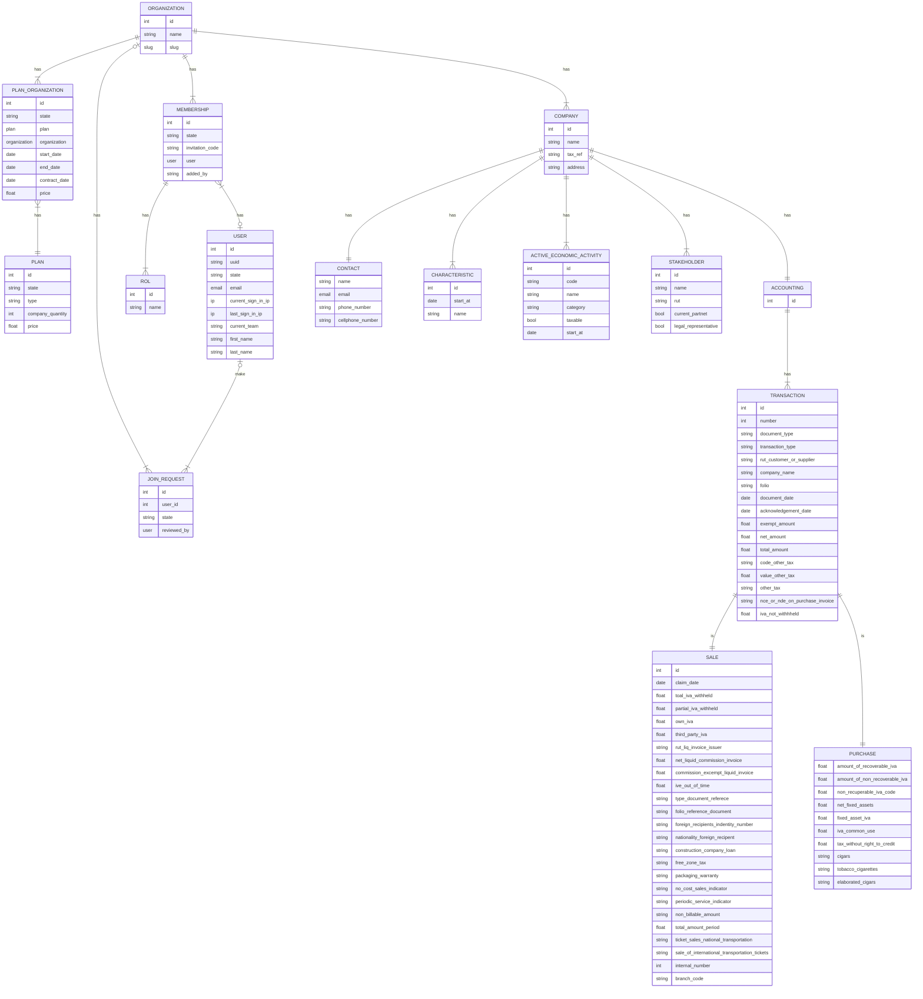

```mermaid
erDiagram
    ORGANIZATION |o--|{ JOIN_REQUEST: has
    ORGANIZATION ||--|{ PLAN_ORGANIZATION : has
    ORGANIZATION ||--|{ COMPANY: has
    ORGANIZATION ||--|{ MEMBERSHIP: has
    PLAN_ORGANIZATION }|--|| PLAN: has
    MEMBERSHIP }|--o| USER: has
    MEMBERSHIP ||--|{ ROL: has
    COMPANY ||--|| ACCOUNTING: has
    COMPANY ||--|| CONTACT: has
    COMPANY ||--|{ CHARACTERISTIC: has
    COMPANY ||--|{ ACTIVE_ECONOMIC_ACTIVITY: has
    COMPANY ||--|{ STAKEHOLDER: has
    USER |o--|{ JOIN_REQUEST: make
    ACCOUNTING ||--|{ TRANSACTION: has
    TRANSACTION ||--|| SALE: is
    TRANSACTION ||--|| PURCHASE: is

    ORGANIZATION {
        int id
        string name
        slug slug
    }
    JOIN_REQUEST{
        int id
        int user_id
        string state
        user reviewed_by
    }
    USER {
        int id
        string uuid
        string state
        email email
        ip current_sign_in_ip
        ip last_sign_in_ip
        string current_team
        string first_name
        string last_name
    }
    MEMBERSHIP{
        int id
        string state
        string invitation_code
        user user
        string added_by
    }
    ROL{
        int id
        string name
    }
    PLAN_ORGANIZATION{
        int id
        string state
        plan plan
        organization organization
        date start_date
        date end_date
        date contract_date
        float price
    }
    PLAN{
        int id
        string state
        string type
        int company_quantity
        float price
    }
    COMPANY {
        int id
        string name
        string tax_ref
        string address
    }
    ACCOUNTING {
        int id
    }

    CONTACT {
        string name
        email email
        string phone_number
        string cellphone_number
    }

    CHARACTERISTIC {
        int id
        date start_at
        string name
    }

    ACTIVE_ECONOMIC_ACTIVITY {
        int id
        string code
        string name
        string category
        bool taxable
        date start_at
    }

    STAKEHOLDER {
        int id
        string name
        string rut
        bool current_partnet
        bool legal_representative
    }
    TRANSACTION {
        int id
        int number
        string document_type
        string transaction_type
        string rut_customer_or_supplier
        string company_name
        string folio
        date document_date
        date acknowledgement_date
        float exempt_amount
        float net_amount
        float total_amount
        string code_other_tax
        float value_other_tax
        string other_tax
        string nce_or_nde_on_purchase_invoice
        float iva_not_withhheld
    }

    SALE {
        int id
        date claim_date
        float toal_iva_withheld
        float partial_iva_withheld
        float own_iva
        float third_party_iva
        string rut_liq_invoice_issuer
        float net_liquid_commission_invoice
        float commission_excempt_liquid_invoice
        float ive_out_of_time
        string type_document_referece
        string folio_reference_document
        string foreign_recipients_indentity_number
        string nationality_foreign_recipent
        string construction_company_loan
        string free_zone_tax
        string packaging_warranty
        string no_cost_sales_indicator
        string periodic_service_indicator
        string non_billable_amount
        float total_amount_period
        string ticket_sales_national_transportation
        string sale_of_international_transportation_tickets
        int internal_number
        string branch_code
    }

    PURCHASE {
        float amount_of_recoverable_iva
        float amount_of_non_recoverable_iva
        float non_recuperable_iva_code
        float net_fixed_assets
        float fixed_asset_iva
        float iva_common_use
        float tax_without_right_to_credit
        string cigars
        string tobacco_cigarettes
        string elaborated_cigars
    }

```