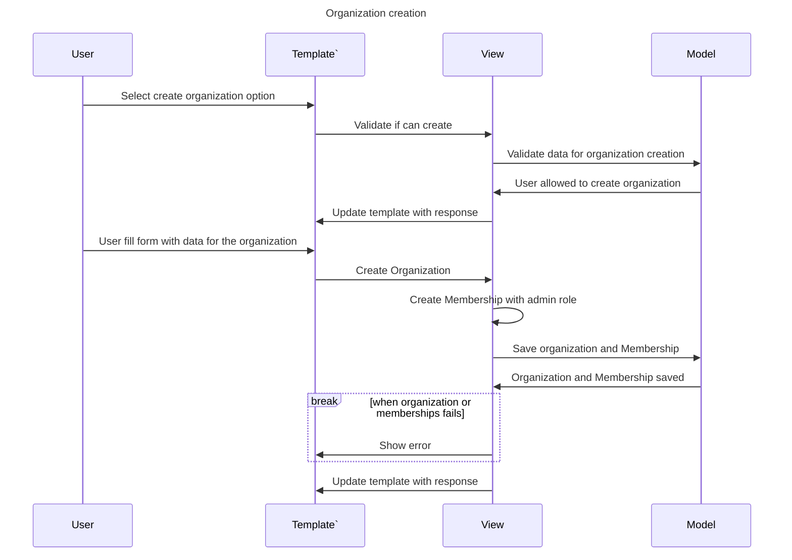

```mermaid
sequenceDiagram
    title Organization creation
    participant U as User
    participant T as Template`
    participant V as View
    participant M as Model

    U->>T: Select create organization option
    T->>V: Validate if can create
    V->>M: Validate data for organization creation
    M->>V: User allowed to create organization
    V->>T: Update template with response
    U->>T: User fill form with data for the organization
    T->>V: Create Organization
    V->>V: Create Membership with admin role
    V->>M: Save organization and Membership
    M->>V: Organization and Membership saved
    break when organization or memberships fails  
    V->>T: Show error
    end
    V->>T: Update template with response

```