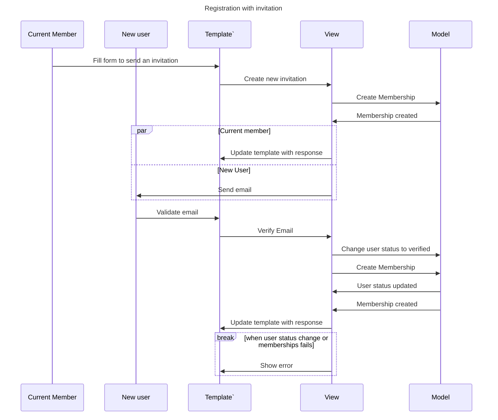

```mermaid
sequenceDiagram
    title Registration with invitation
    participant C as Current Member 
    participant N as New user
    participant T as Template`
    participant V as View
    participant M as Model

    C->>T: Fill form to send an invitation
    T->>V: Create new invitation
    V->>M: Create Membership
    M->>V: Membership created
    par Current member
        V->>T: Update template with response
    and New User
        V->>N: Send email 
    end
    N->>T: Validate email
    T->>V: Verify Email
    V->>M: Change user status to verified
    V->>M: Create Membership
    M->>V: User status updated
    M->>V: Membership created
    V->>T: Update template with response 
    break when user status change or memberships fails
    V->>T: Show error
    end


```