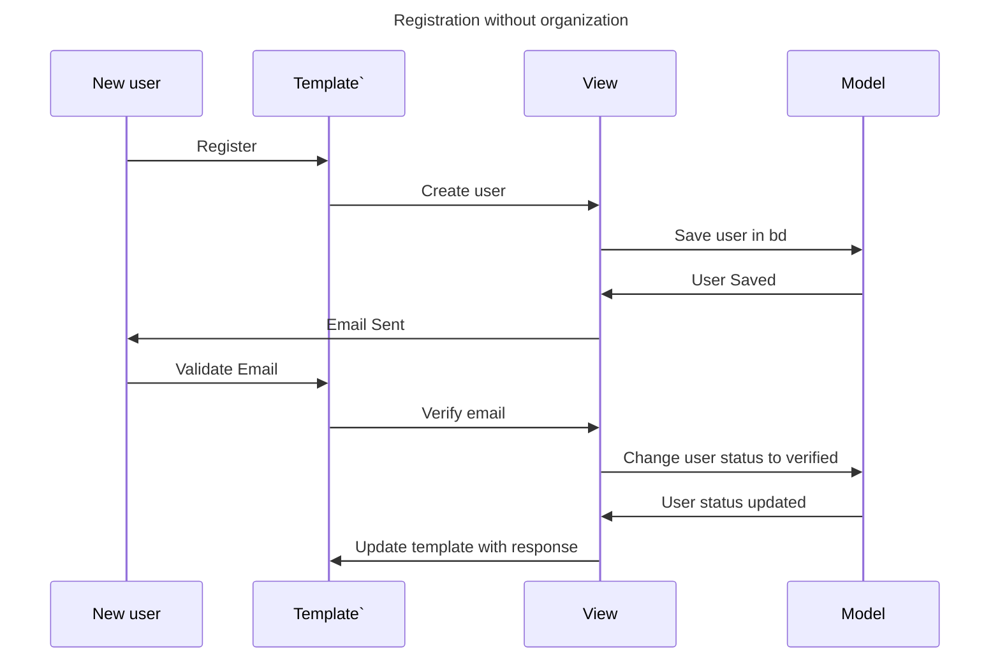

```mermaid
sequenceDiagram
    title Registration without organization
    participant N as New user
    participant T as Template`
    participant V as View
    participant M as Model

    N->>T: Register
    T->>V: Create user
    V->>M: Save user in bd
    M->>V: User Saved
    V->>N: Email Sent
    N->>T: Validate Email
    T->>V: Verify email
    V->>M: Change user status to verified
    M->>V: User status updated
    V->>T: Update template with response
```